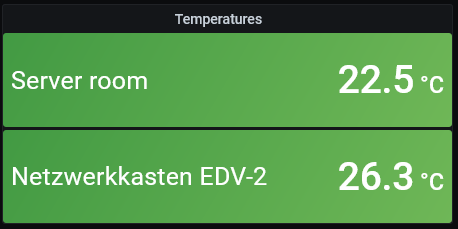
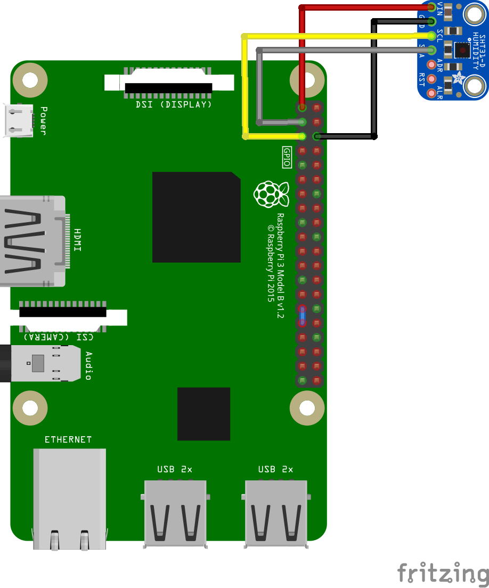

# SHT3x exporter

A Prometheus exporter for gathering temperature and humidity using a SHT3x sensor and the Raspberry Pi.

Wire up the sensor as described below, install the exporter using Docker and you are ready to measure the temperature and humidity of the sensor's location.

I'm using this to measure the ambient temperature in a server room and network closet. The temperature is displayed on a Grafana dashboard, and I'm receiving alerts when the temperature exceeds a threshold.

## Required hardware

A Raspberry Pi aside, you are going to need a SHT3x temperature sensor and some method for wiring it up to the Pi. Your sensor might look different than the one pictured in the image below. You only need the VIN, GND, SCL and SDA pins.

## Enabling I2C on the Raspberry

To use the SHT3x sensor, you'll have to enable the I2C interface on the Raspberry. Run `sudo raspi-config` and enable I2C under "Interface Options".

## Installation

Install Docker and run

    docker run -p 9892:9892 --device /dev/i2c-1 lukeciel/sht3x_raspberry_exporter

That will expose the metrics on port 9892.